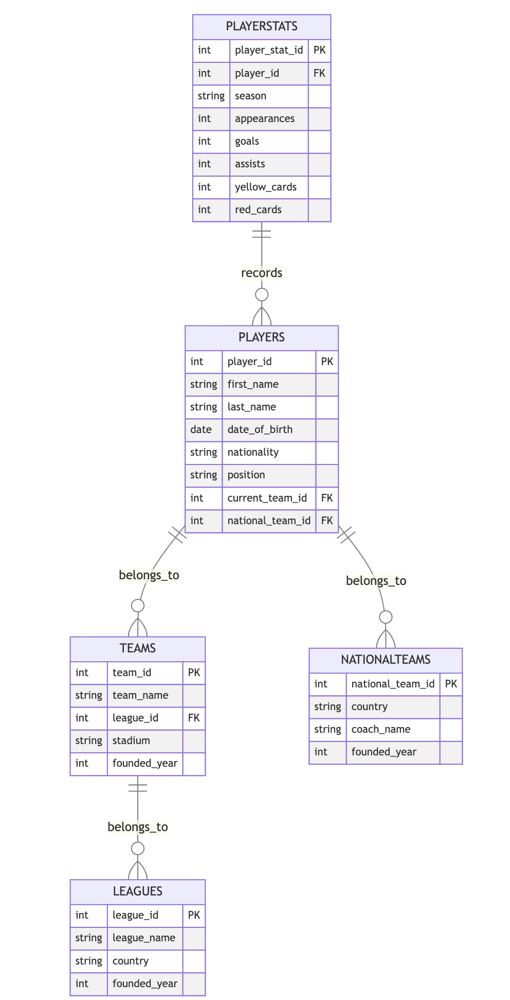

# Design Document

By OH UNGCHAN

Video overview: <https://drive.google.com/file/d/1Nkl2HYnOMkGwAIkzImyrNDxHyBuSI2L9/view?usp=sharing>

## Scope

Purpose of the Database:
The purpose of this database is to manage and organize data related to football players, teams, national teams, leagues, and player statistics. The database aims to provide an efficient way to store, retrieve, and analyze information, facilitating tasks such as tracking player performance, team compositions, league standings, and historical data.

Scope of the Database:
People: Football players, team coaches, and national team coaches.
Places: Teams (clubs), national teams, leagues, stadiums.
Things: Player statistics (appearances, goals, assists, etc.), team details, league details, and national team details.

Out of Scope:
Detailed match data (e.g., individual match events, scores).
Financial transactions (e.g., player transfers, salaries).
Fan data, ticket sales, or merchandising information.
Historical data beyond the scope of player statistics by season.

## Functional Requirements

User Capabilities:
Users should be able to retrieve detailed information about players, including their current team and national team.
Users should be able to view details of teams, including their league and stadium.
Users should be able to analyze player statistics by season.
Users should be able to see a list of teams within each league.

Beyond the Scope:
Users should not be able to modify the database structure.
Users should not be able to perform financial operations or access sensitive financial data.
Users should not be able to retrieve real-time match data or live updates.

## Representation

### Entities

#### Players

Attributes:
player_id: INT, Primary Key
first_name: VARCHAR(50)
last_name: VARCHAR(50)
date_of_birth: DATE
nationality: VARCHAR(50)
position: VARCHAR(30)
current_team_id: INT, Foreign Key to Teams
national_team_id: INT, Foreign Key to NationalTeams
Rationale: These attributes provide a comprehensive profile of each player, including personal details and current affiliations.

#### Teams

Attributes:
team_id: INT, Primary Key
team_name: VARCHAR(100)
league_id: INT, Foreign Key to Leagues
stadium: VARCHAR(100)
founded_year: INT
Rationale: These attributes capture essential information about each team, including their association with a league and their home stadium.

#### NationalTeams

Attributes:
national_team_id: INT, Primary Key
country: VARCHAR(50)
coach_name: VARCHAR(100)
founded_year: INT
Rationale: These attributes define the national teams, including their country and coach, which are critical for identifying and differentiating them.

#### Leagues

Attributes:
league_id: INT, Primary Key
league_name: VARCHAR(100)
country: VARCHAR(50)
founded_year: INT
Rationale: These attributes capture the details of the leagues, which is important for organizing the teams and understanding the structure of competitions.

#### PlayerStats

Attributes:
player_stat_id: INT, Primary Key
player_id: INT, Foreign Key to Players
season: VARCHAR(20)
appearances: INT
goals: INT
assists: INT
yellow_cards: INT
red_cards: INT
Rationale: These attributes provide detailed statistics for players by season, which is essential for performance analysis.

### Relationships

The below entity relationship diagram describes the relationships among the entities in the database.

A Player belongs to one Team and one NationalTeam.
A Team belongs to one League.
A PlayerStat is associated with one Player for a specific season.

## Optimizations

#### Indexes
Player Indexes: Index on current_team_id and national_team_id to speed up joins with the Teams and NationalTeams tables.
Team Indexes: Index on league_id to speed up joins with the Leagues table.
PlayerStats Indexes: Composite index on player_id and season to quickly retrieve statistics for a player in a particular season.

#### Views
PlayerDetails: Provides comprehensive information about players, including their current team and national team.

## Limitations

### Design Limitations
The current design does not include detailed match data, which could limit the ability to analyze individual match performance.
Financial data such as player transfers and salaries are not represented, limiting the database’s use for financial analysis.

### Representation Limitations
The database does not account for historical data beyond player statistics by season, which might limit longitudinal analysis over multiple seasons.
Real-time data and live updates are not supported, which could be a limitation for applications requiring up-to-date information.

### Scalability and Performance
As the database grows, especially with player statistics, performance might degrade without further optimizations such as additional indexing or partitioning of large tables.
